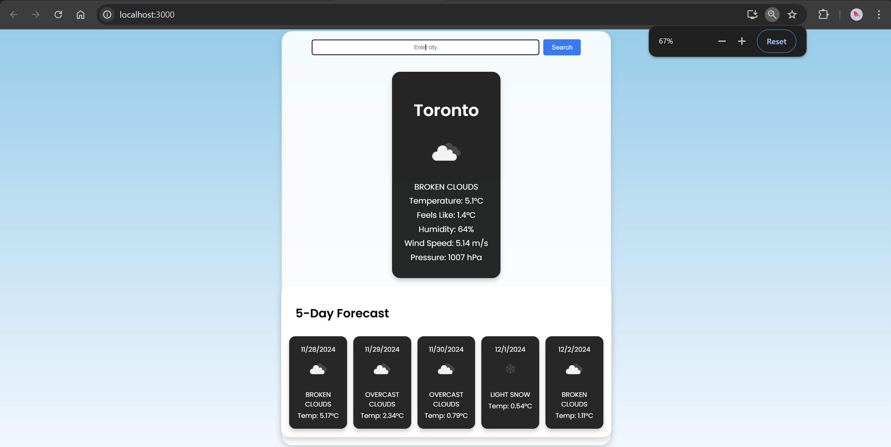
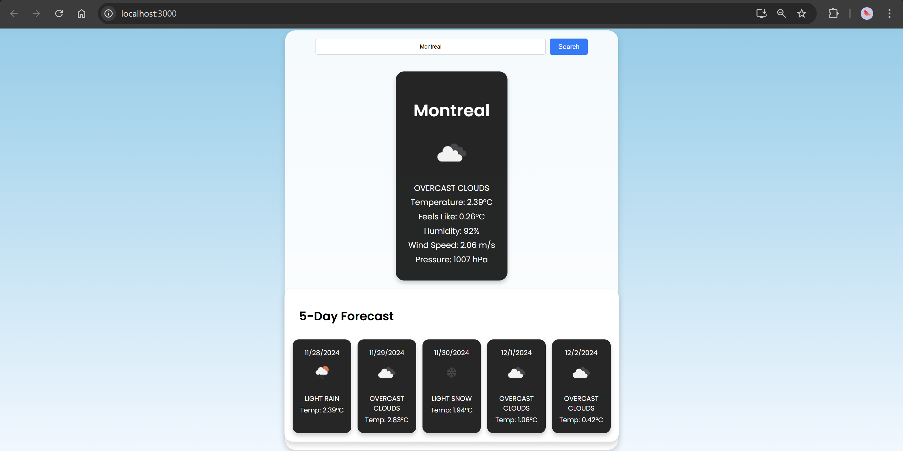
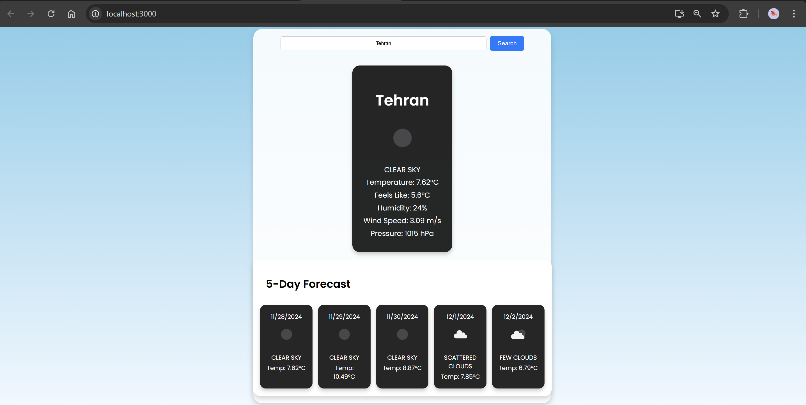
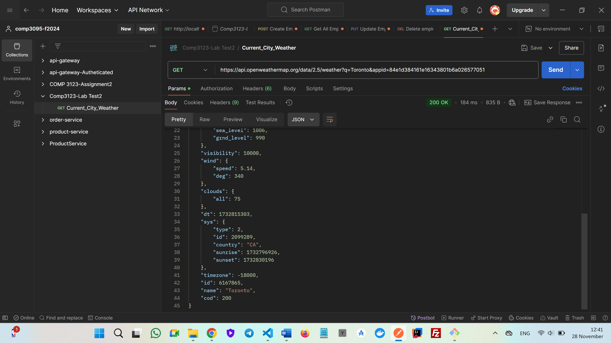

# Weather App

A simple weather app built with ReactJS that fetches current weather conditions and a 5-day forecast for any city using the OpenWeatherMap API.

## Features

- Display current weather conditions, including temperature, humidity, wind speed, and pressure.
- 5-day forecast with weather icons and temperatures.
- Dynamic city search functionality.
- Responsive and modern UI with a clean layout.

## Technologies Used

- ReactJS
- Axios for API integration
- OpenWeatherMap API
- CSS (Flexbox, responsiveness)

## Setup Instructions

1. Clone this repository
2. Navigate to the project directory:
3. Install dependencies:
4. Create a `.env` file in the root directory and add your OpenWeatherMap API key:
5. Start the app:
   
   
   
   

## API Reference

[OpenWeatherMap API](https://openweathermap.org/)

## Author

Dorsa Mohammadi 101397591
